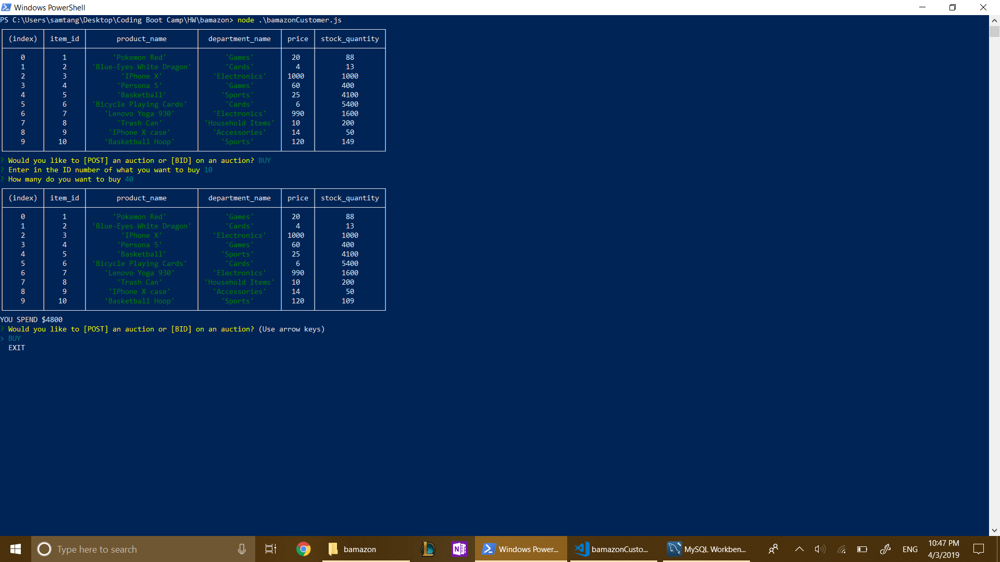
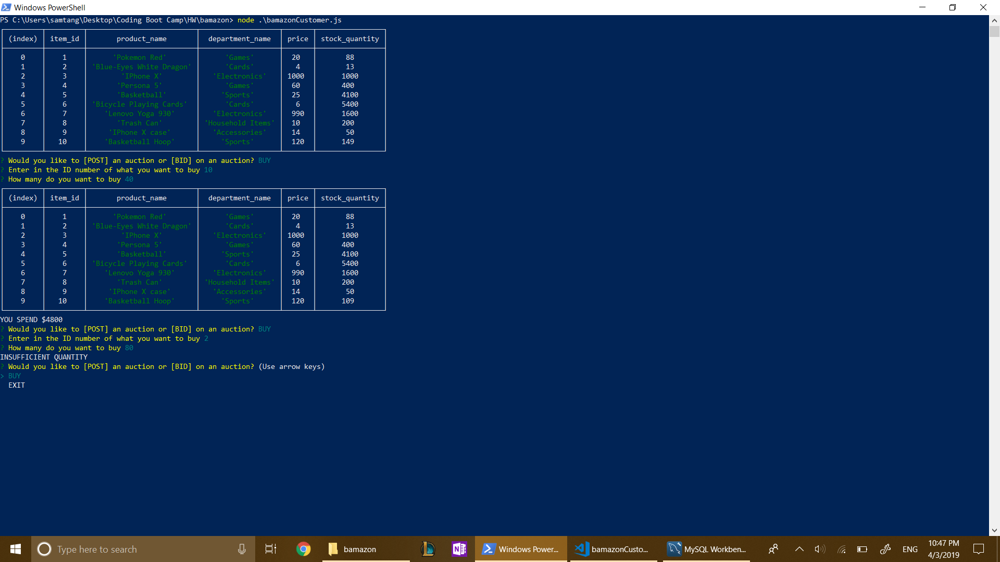

# bamazon

This project is an amazon app that simulates a user buying an product and keeping track of inventory using MySQL server

Start by selecting if you want to buy or not

<<<<<<< HEAD

Then choose which item you want by ID and how much you want to buy

If you buy more than inventory has, it won't let you buy it

If you don't want to shop anymore, then exit

=======

Then choose which item you want by ID and how much you want to buy

If you buy more than inventory has, it won't let you buy it

If you don't want to shop anymore, then exit

>>>>>>> 1bda7045da086263934fb9301de6addbf4e6a73f
