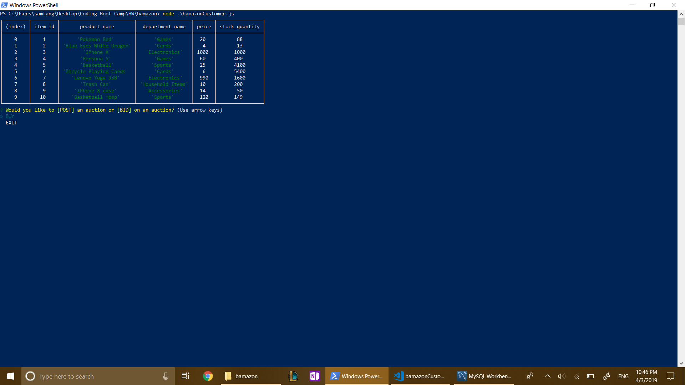
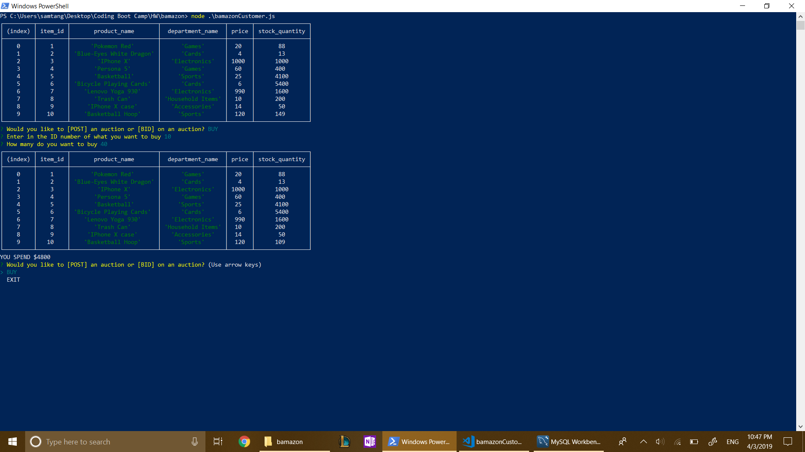
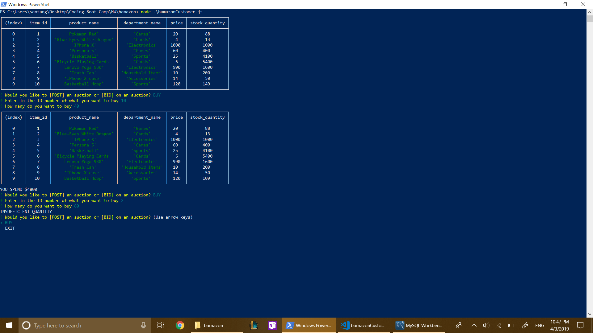
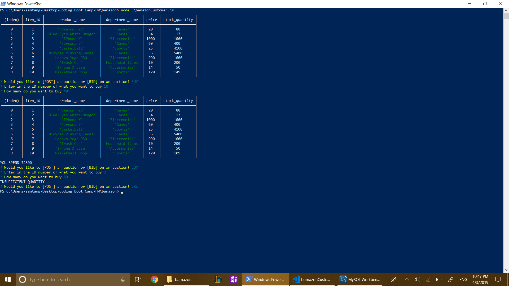

# Bamazon CLI Store

A command-line storefront built with Node.js and MySQL. The application lists
products, accepts purchase requests, prevents orders that exceed inventory, and
updates stock quantities after successful purchases.

## Features

- Display the product catalog in the terminal
- Select products by database ID
- Validate requested quantity against inventory
- Calculate the purchase total
- Persist inventory changes in MySQL

## Technology

- Node.js
- MySQL
- Inquirer

## Setup

```bash
npm install
mysql -u root -p < bamazon.sql
```

Update the local MySQL credentials in `bamazonCustomer.js`.

## Run

```bash
node bamazonCustomer.js
```

The application prints the catalog, asks whether you want to buy or exit, then
prompts for a product ID and quantity.

## Screenshots






## Project Status

This is a legacy command-line coursework project. Database configuration is
stored directly in the script and should be moved to environment variables
before broader use.
